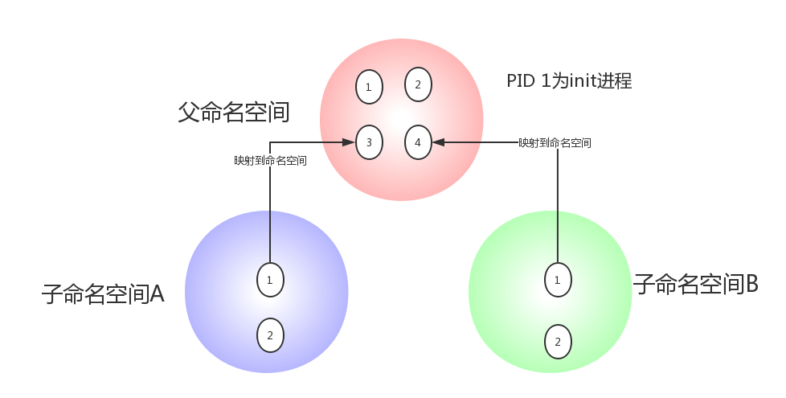

# Linux Namespace 介绍

我们经常听到说Docker 是一个使用了Linux Namespace 和 Cgroups 的虚拟化工具，但是什么是Linux Namespace 它在Docker内是怎么被使用的，说到这里很多人就会迷茫，下面我们就先介绍一下Linux Namespace 以及它们是如何在容器里面使用的。

## 概念

Linux Namespace 是kernel 的一个功能，它可以隔离一系列系统的资源，比如PID(Process ID)，User ID, Network等等。一般看到这里，很多人会想到一个命令`chroot`，就像`chroot`允许进程以 root 身份查看任意一个目录(被隔离开来的)一样，Namesapce也可以在一些资源上，将进程隔离起来，这些资源包括进程树，网络接口，挂载点等等。

比如一家公司向外界出售自己的计算资源。公司有一台性能还不错的服务器，每个用户买到一个tomcat实例用来运行它们自己的应用。有些调皮的客户可能不小心进入了别人的tomcat实例，修改或者关闭了其中的某些资源，这样就会导致各个客户之间互相干扰。也许你会说，我们可以限制不同用户的权限，让用户只能访问自己名下的tomcat，但是有些操作可能需要系统级别的权限，比如root。我们不可能给每个用户都授予root权限，也不可能给每个用户都提供一台全新的物理主机让他们互相隔离，因此这里Linux Namespace就派上了用场。使用Namespace， 我们就可以做到UID级别的隔离，也就是说，我们可以以UID为n的用户，虚拟化出来一个namespace，在这个namespace里面，用户是具有root权限的。但是在真实的物理机器上，他还是那个UID为n的用户，这样就解决了用户之间隔离的问题。当然这个只是Namespace其中一个简单的功能。

除了User Namespace ,PID也是可以被虚拟的。命名空间建立系统的不同视图， 对于每一个命名空间，从用户看起来，应该像一台单独的Linux计算机一样，有自己的init进程(PID为1)，其他进程的PID依次递增，A和B空间都有PID为1的init进程，子容器的进程映射到父容器的进程上，父容器可以知道每一个子容器的运行状态，而子容器与子容器之间是隔离的。从图中我们可以看到，进程3在父命名空间里面PID 为3，但是在子命名空间内，他就是1.也就是说用户从子命名空间 A 内看进程3就像 init 进程一样，以为这个进程是自己的初始化进程，但是从整个 host 来看，他其实只是3号进程虚拟化出来的一个空间而已。
